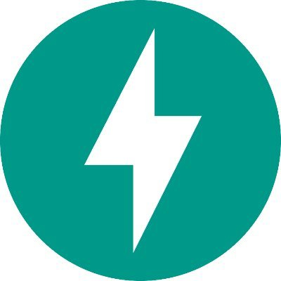
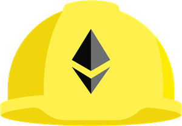

### Hi there 👋 I'm Jayon, a Blockchain Developer and Enthusiast

Thanks for taking the time to check my profile and feel free to reach out. I have experience in Full Stack Web Development as well as Web3 development. Eager to learn and explore different technologies, I believe in applying new tech and ideas to enhance products or contribute to society. I am extremely interested in the blockchain space and it's something I believe can and will help shape the future of the world. 

- 📫 Feel free to reach out at <jpkim921@gmail.com>

## Tech Stack
* Python
* Django
* FastApi
* Solidity
* Web3.js | Ethers.js
* Hardhat | Truffle
* Chai | Mocha 
* Javascript
* Typescript
* React.js
* Redux
* Node.js
* Redis
* SQL
* Docker
* Heroku

<!-- ## Programming Language and Technologies
               
                   -->
 
## Extra Stuff
  - :octocat: [My Resume](https://drive.google.com/file/d/1qJopBH4wOOcHCCzFdwmBDeJH42-Ao60K/view?usp=sharing)

